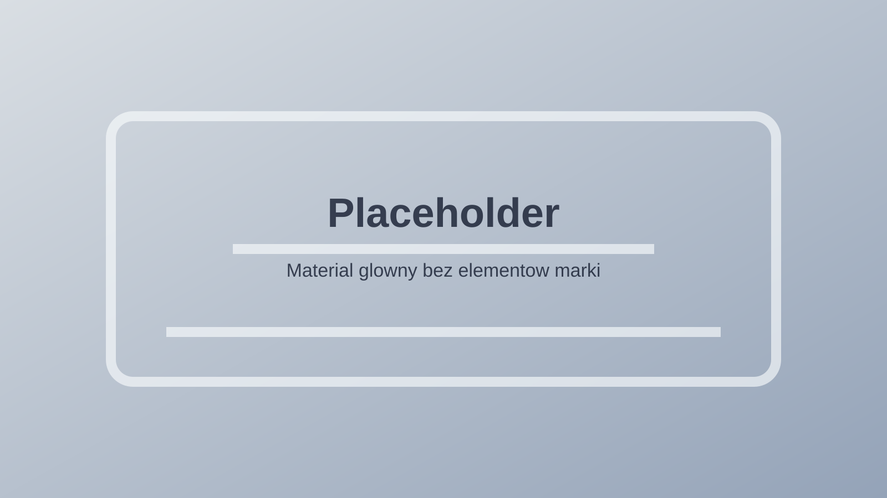
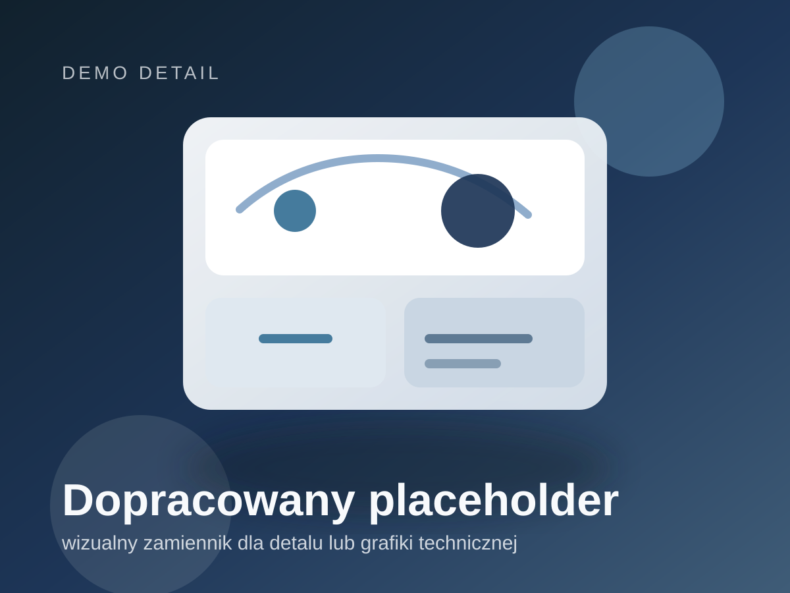

# Dwie kafelki responsive live

Neutralny projekt front-end z dwoma wariantami prezentacji opartymi o kafelki, lokalne placeholdery i tekst lorem ipsum.

## Co zawiera projekt

1. `index.html` - karuzela 2x2 z czterema kafelkami demo.
2. `index2.html` - wersja fullscreen z dwoma kafelkami, rozwijanym opisem i lightboxem.
3. `placeholder-hero.svg` i `placeholder-detail.svg` - lokalne materialy demo bez zewnetrznych linkow.

## Najwazniejsze funkcje

1. Pelna responsywnosc na desktopie i mobile.
2. Obsluga klawiatury: `Enter`, `Spacja`, `Escape`.
3. Lokalne assety zamiast zewnetrznych mediow.
4. Fallback dla niedostepnych plikow graficznych.
5. Rozwijane opisy, lightbox i interaktywne stany kafelkow.

## Zrzuty demo

### Podglad 1

### Podglad 2

## Jak uruchomic lokalnie

1. Otworz folder projektu w VS Code.
2. Uruchom Live Server albo otworz `index.html` lub `index2.html` bezposrednio w przegladarce.

## Uwagi

1. Z projektu usunieto zewnetrzne linki do mediow.
2. Widoczne nazwy i opisy zostaly zastapione neutralna trescia demo.
3. README pokazuje lokalne materialy podgladowe, wiec repo jest samowystarczalne po sklonowaniu.