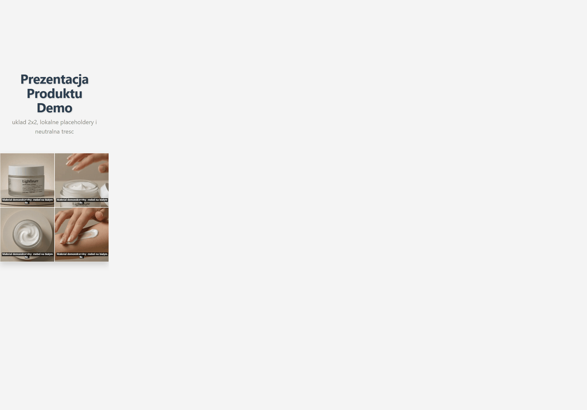

# Dwie kafelki responsive live

Nowoczesny, lekki i gotowy do wdrozenia koncept front-end do prezentacji produktu premium.
Projekt jest przygotowany jako baza pod strony kampanijne, microsite produktowe i landing page'e
z naciskiem na wizualna jakosc, szybkie ladowanie i interakcje, ktore realnie wspieraja konwersje.

## Opis komercyjny

1. Format 2x2 i fullscreen pozwala pokazac produkt z kilku perspektyw bez przeladowania trescia.
2. Interakcje (zoom, lightbox, ekspansja kart) buduja efekt premium i wydluzaja czas kontaktu z oferta.
3. Uklad jest responsywny i gotowy pod desktop, tablet i mobile.
4. Struktura kodu jest prosta do rebrandingu pod dowolna marke, branze i styl wizualny.
5. Projekt moze byc szybko rozbudowany o CTA, formularz leadowy, analityke i A/B testy.

## Co zawiera repo

1. index.html - wariant karuzeli 2x2 z czterema kafelkami i lokalnym materialem wideo.
2. index2.html - wariant fullscreen z dwoma kafelkami, rozwijanym opisem i lupowaniem w lightboxie.
3. assets/videos/kadry-1.mp4 do assets/videos/kadry-4.mp4 - lokalne klipy demo podlaczone bez zewnetrznych URL.
4. captions-pl.vtt i descriptions-pl.vtt - podstawowe sciezki dostepnosci dla materialow wideo.

## Demo

1. Wariant 1: otworz index.html.
2. Wariant 2: otworz index2.html.
3. Rekomendowane uruchomienie przez lokalny serwer HTTP (zamiast file://), aby uniknac problemow z odtwarzaniem.

## Live (GitHub Pages)

1. Strona glowna: https://stelled40.github.io/dwie-kafelki-responsive-live/
2. Wariant 1: https://stelled40.github.io/dwie-kafelki-responsive-live/index.html
3. Wariant 2: https://stelled40.github.io/dwie-kafelki-responsive-live/index2.html
4. Publikacja jest automatyczna po push na branch main (workflow GitHub Actions).

Przyklad:

```bash
python -m http.server 8080
```

Nastepnie wejdz na:

1. http://127.0.0.1:8080/index.html
2. http://127.0.0.1:8080/index2.html

## Najwazniejsze funkcje

1. Responsywny layout i plynne przejscia.
2. Obsluga klawiatury i podstawowe wsparcie dostepnosci.
3. Lokalne assety i fallback dla mediow.
4. Interaktywne stany kafelkow i warstwa podgladu (lightbox).

## Material podgladowy (realne screeny + live GIF)

### Screen 1 - index.html


### Screen 2 - index2.html


### GIF live

